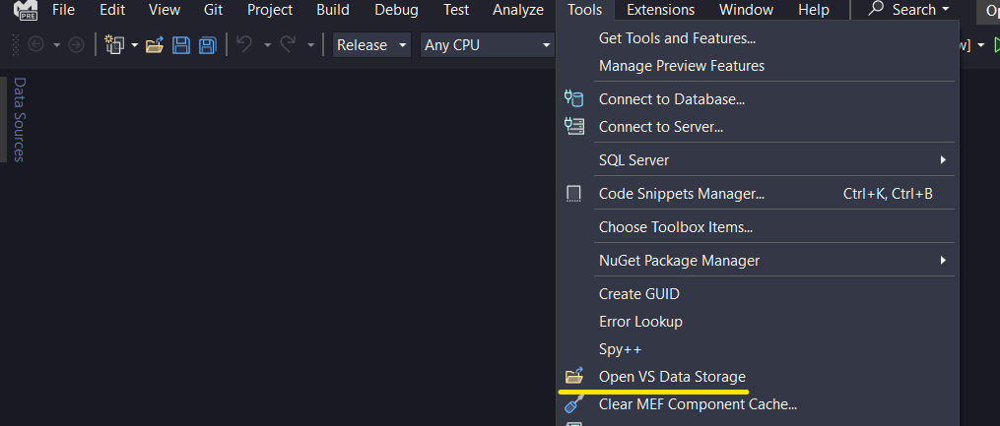

# Open VS Data

A Visual Studio Extension that opens the user data storage folder of the current IDE instance.

You can download the extension from the [VS Gallery](https://marketplace.visualstudio.com/items?itemName=mariasolos.openvsdata)!

## Using the extension

After installing the extension, a new command will be available in 
In Visual Studio's top menu under Tools, a new command is now visible:

Clicking the **Open VS Data Storage** button will open the file explorer in the respective location.

## License
[Apache 2.0](LICENSE) 